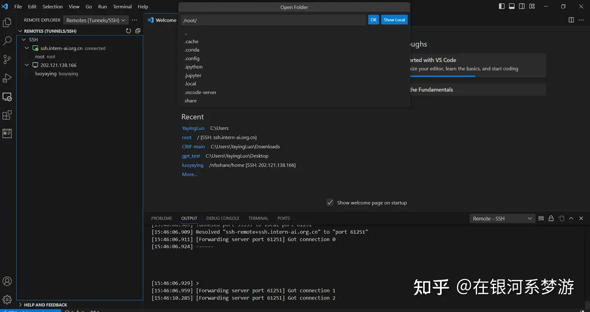
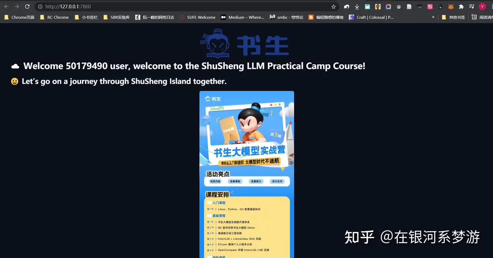

目标：通过在VSCODE配置SSH连接，实现在本地远程使用开发机

1. VSCODE配置SSH远程连接，在InternStudio启动开发机，输入密码进入。
- 要想免密码登录，可以配置SSH密钥。不过InternStudio里配置SSH密钥（公钥）的前提要求是主机不含中文字符，我的电脑含中文字符遂作罢。

2. 开发机运行Http服务，本地powershell执行端口转发命令时报错：`Bad owner or permissions on C:\\Users\\YayingLuo/.ssh/config`

 解决：参考文章 https://blog.csdn.net/Osiria/article/details/132045748Remote-ssh 

原因分析：VSCODE的remote-ssh扩展将.ssh的config文件权限进行了修改，且通过普通方式查看不了具体权限。需要将remote-ssh的config填写至另外的地址，并将原来的.ssh文件夹删除。（端口映射不需要本地的.ssh文件）。

按照上述步骤操作后重新尝试，手动输入开发机密码，若端口转发成功powershell不会有任何提示。

在开发机terminal运行编写的hello.py，打开127.0.0.1:7860，网页内容成功显示。

