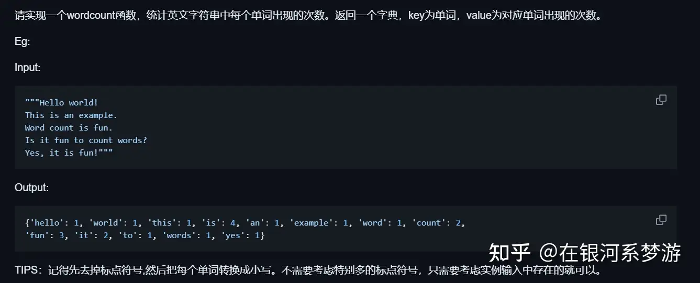
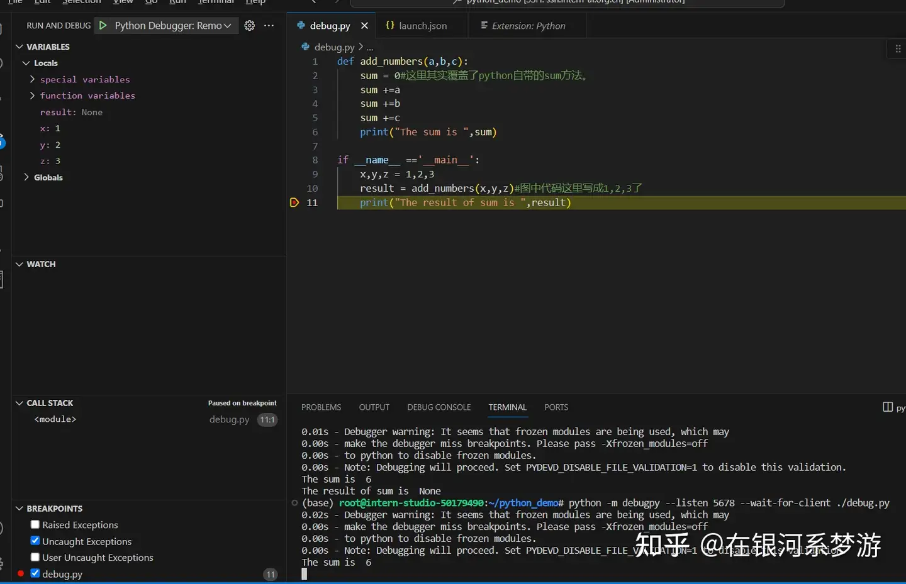

任务一：实现对文本的单词计数wordcount

思路：

得到字典，就需要一个单词list，一个词频list，最后映射成字典（具有相同的key时会保留最后一个value）

1. 构建单词list：切分字符串，完成文本的大小写转换，去除标点
2. 构建单词的词频list：遍历得到每个单词，对单词list进行count计数
3. 构建字典：接受以tuple对为输入，相同key保留最后的value。 zip函数实现一一对应的tuple，再包装成list作为zip的输入。

python前置知识：

- 字符串切分函数：string.split()【string 转list】
- 大写转小写： word.lower()
- 去除标点： word.strip(',.!')
- 对列表计数：list.count(list[i])
- 列表插入：list.append()

代码实现：

任务二：vscode远程连接开发机

ssh远程调试开发机上的python文件，并能在命令行调试语句

- ssh远程连接添加python debug插件，方可插入断点
- conda install debugpy
- 完成插入断点，并进入debug模式，创建launch.json并选择- - remote debug xxxxx，连续回车默认端口号配置
- 控制台命令：`python -m debugpy --listen 5678 --wait-for-client ./debug.py`
- 点击debug的小绿按钮开始debug
